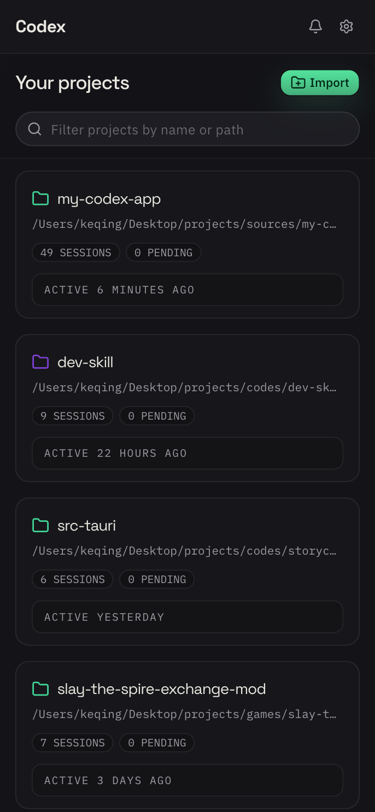
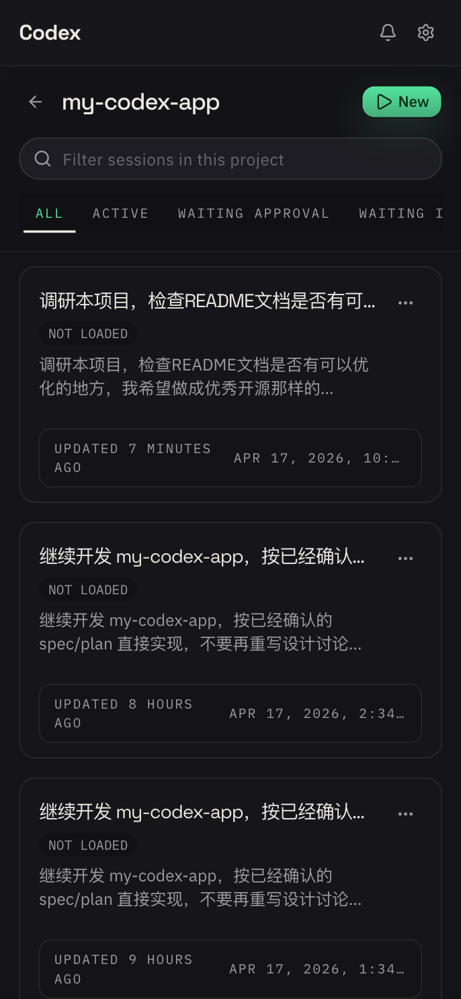
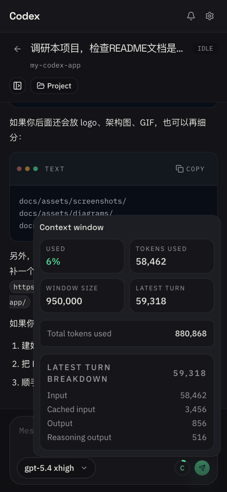
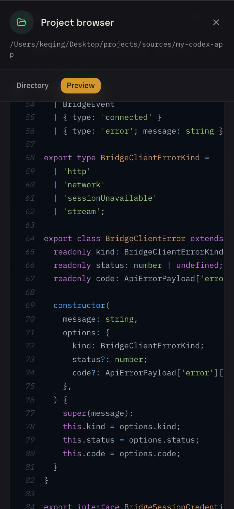

# My Codex App


**[English](./README.md) | [中文](./README.zh.md)**

在不把执行环境搬离电脑的前提下，通过浏览器或手机访问
[Codex](https://github.com/openai/codex)。`my-codex-app` 将本地 bridge 守护进程
`codexb`、共享 React 客户端，以及 Tauri 移动端宿主壳组合在一起，让你可以查看
实时线程、响应审批，并在网络中断后快速恢复连接。

**链接：** [托管 Web 客户端](https://lovezhangchuangxin.github.io/my-codex-app/)
· [Bridge CLI 文档](./apps/bridge/README.md) ·
[架构规格](./docs/specs/2026-04-10-codex-mobile-web-platform.md)

## 托管客户端

可以直接访问这里体验托管版 Web 客户端：

- <https://lovezhangchuangxin.github.io/my-codex-app/>

说明：

- 这是部署在 GitHub Pages 上的共享 Web 客户端生产构建。
- 如果要连接真实会话，仍然需要你自己的 bridge 正在运行。
- 如果你的 bridge 只是默认的明文 `http://<lan-ip>:8787`，某些浏览器可能会拦截
  托管 `https` 客户端发起的请求。遇到这种情况，优先本地运行 `pnpm dev:client`，
  或者把 bridge 放到 HTTPS 反向代理之后。

## 为什么做这个项目

- **Codex 始终本地运行。** Bridge 通过 `codex app-server` 与 Codex 通信，代码、
  工具执行和上下文都留在你的机器上。
- **浏览器和手机共用一套产品。** 浏览器客户端是主界面，Tauri 移动端复用同一套
  Web 应用。
- **显式配对，而不是共享静态密钥。** 每台设备都需要单独配对，并且之后可以撤销。
- **基于官方集成面，而不是私有 IPC。** 本仓库围绕 `codex app-server` 构建，
  不依赖桌面端私有协议。

## 项目状态

- **Alpha 阶段。** Bridge、共享客户端和移动端宿主壳都在持续开发中。
- **当前支持局域网模式。** 规划中的跨网络 relay 还没有实现。
- **Bridge 只提供 API。** 它不会托管前端；前端需要单独静态部署，或在开发环境中本地运行。
- **移动端壳已在仓库内。** 目前没有公开宣布应用商店发行渠道。

## 目前可以做什么

- 浏览最近线程并打开完整线程详情
- 实时查看 turn 进度和助手输出
- 发送消息、创建线程、打断进行中的 turn
- 在统一入口处理中待审批、权限请求和工具用户输入
- 为浏览器或设备做本地配对，并在之后撤销信任
- 在断线后重新连接，并从 bridge 的权威状态中恢复同步

## 产品截图

<table>
  <tr>
    <td width="50%">
      <strong>项目列表页</strong><br />
      
    </td>
    <td width="50%">
      <strong>项目会话列表页</strong><br />
      
    </td>
  </tr>
  <tr>
    <td width="50%">
      <strong>会话详情页</strong><br />
      
    </td>
    <td width="50%">
      <strong>项目浏览器页面</strong><br />
      
    </td>
  </tr>
</table>

## 架构

```text
┌──────────────┐    局域网 / Relay（规划中）   ┌──────────────────┐    stdio JSON-RPC    ┌───────────────┐
│  浏览器 /     │ ◄────────────────────────► │  Bridge (codexb) │ ◄──────────────────► │  Codex CLI    │
│  移动端 App   │         HTTP + SSE         │                  │                      │  app-server   │
└──────────────┘                              └──────────────────┘                      └───────────────┘
```

- **Bridge (`codexb`)**：桌面守护进程，连接 Codex 并暴露 HTTP + SSE API
- **Client**：浏览器优先的 React 应用，由浏览器和 Tauri 移动端宿主共享
- **Protocol**：`packages/protocol` 中的 bridge-client 类型契约
- **SDK**：`packages/sdk` 中的传输层、线程运行时和实时事件合并逻辑

## 快速开始

### 方案 A：直接使用发布版 bridge

1. 安装 [Codex CLI](https://github.com/openai/codex)，并确保 `codex` 在
   `PATH` 中可用。
2. 安装 bridge：

   ```sh
   npm i -g @my-codex-app/bridge
   ```

3. 启动守护进程：

   ```sh
   codexb start
   ```

4. 检查健康状态和配对信息：

   ```sh
   codexb doctor
   codexb pair show
   ```

5. 连接客户端：
   - **Web**：打开托管客户端
     `https://lovezhangchuangxin.github.io/my-codex-app/`，在本仓库中本地运行客户端，
     或把 `apps/client` 的静态构建部署到任意静态托管平台
   - **Mobile**：运行或构建 `apps/mobile` 中的 Tauri 宿主壳，再扫描
     `codexb pair show` 展示的二维码

快速校验：打开 `http://<bridge-url>/healthz`，应返回 `{"status":"ok"}`。

完整 CLI 参考请查看 [apps/bridge/README.md](./apps/bridge/README.md)。

### 方案 B：本地运行整个仓库

#### 前置条件

- [Node.js](https://nodejs.org/) >= 22
- [pnpm](https://pnpm.io/) >= 10
- 已安装并配置 [Codex CLI](https://github.com/openai/codex)

#### 环境准备

```sh
pnpm install
cp .env.example .env
# 编辑 .env，将 CODEX_SOURCE_CODE_HOME 指向本地 Codex 源码仓库
pnpm build
```

`CODEX_SOURCE_CODE_HOME` 用于引用上游 Codex 源码，以校验 `codex app-server`
行为和相关集成细节。

#### 开发模式

```sh
pnpm dev:bridge
pnpm dev:client
```

打开 `http://localhost:5173`，按需填写 bridge 地址，然后在 `/pair` 完成配对。

Web 客户端本质上是一个静态 Vite 应用。仓库内已经包含 GitHub Pages 部署工作流
`.github/workflows/deploy-client.yml`，当前部署地址是
`https://lovezhangchuangxin.github.io/my-codex-app/`，但你也可以部署到任意静态托管平台。

## 移动端说明

Bridge 地址必须指向运行 bridge 的电脑，而不是手机本身。

- Android 模拟器：使用 `http://10.0.2.2:8787`
- 局域网真机：使用你电脑的局域网 IP，例如 `http://192.168.1.23:8787`
- USB 调试并做端口反向代理：执行 `adb reverse tcp:8787 tcp:8787`，然后使用
  `http://127.0.0.1:8787`

如果 `http://<bridge-target>/healthz` 不能返回 `{"status":"ok"}`，那么配对和线
程 API 也不会正常工作。

## Monorepo 结构

| 路径                | 包 / 应用                | 职责                             |
| ------------------- | ------------------------ | -------------------------------- |
| `apps/bridge`       | `@my-codex-app/bridge`   | 桌面 bridge 守护进程和 CLI       |
| `apps/client`       | `@my-codex-app/client`   | 浏览器与移动端共享 React 客户端  |
| `apps/mobile`       | `@my-codex-app/mobile`   | 复用 `apps/client` 的 Tauri 2 壳 |
| `packages/protocol` | `@my-codex-app/protocol` | 共享 bridge-client 协议类型      |
| `packages/sdk`      | `@my-codex-app/sdk`      | 传输层、线程运行时、事件合并逻辑 |
| `docs/`             | 规格 / 计划 / 参考文档   | 产品、架构与集成文档             |

## 常用命令

| 命令                                      | 说明                         |
| ----------------------------------------- | ---------------------------- |
| `pnpm dev:bridge`                         | 启动 bridge 开发服务         |
| `pnpm dev:client`                         | 启动 client 开发服务         |
| `pnpm mobile:android:dev`                 | 在 Android 上运行 Tauri 应用 |
| `pnpm mobile:android:build`               | 构建 Android 发布产物        |
| `pnpm mobile:ios:dev`                     | 在 iOS 上运行 Tauri 应用     |
| `pnpm build`                              | 构建所有包                   |
| `pnpm typecheck`                          | 对整个 monorepo 做类型检查   |
| `pnpm --filter @my-codex-app/bridge test` | 运行 bridge 测试             |
| `pnpm fmt`                                | 格式化整个仓库               |

## 文档入口

如果你想先理解产品和架构，而不是直接运行项目，建议从这里开始：

- [docs/specs/2026-04-10-codex-mobile-web-platform.md](./docs/specs/2026-04-10-codex-mobile-web-platform.md)
- [docs/plans/2026-04-10-codex-mobile-web-platform.md](./docs/plans/2026-04-10-codex-mobile-web-platform.md)
- [docs/reference/2026-04-11-codex-upstream-integration-guide.md](./docs/reference/2026-04-11-codex-upstream-integration-guide.md)
- [apps/bridge/README.md](./apps/bridge/README.md)

## 发包

计划发布到 npm `@my-codex-app` scope 下的包有三个：

- `@my-codex-app/protocol`
- `@my-codex-app/sdk`
- `@my-codex-app/bridge`

版本使用 [changesets](https://github.com/changesets/changesets) 的 fixed 模式管理，
也就是这些包共享同一个版本号。

发布流程：

```sh
pnpm changeset
pnpm version
pnpm release
```

`pnpm release` 会执行 `pnpm build && changeset publish`。

Android 应用的发布与 npm 包分开进行。`.github/workflows/release-android.yml`
会从 `apps/mobile` 构建签名后的 Android 发布产物，并把 universal APK 与
AAB 上传到 GitHub Release。这个工作流依赖仓库 Actions secrets 中配置的
Android 签名 keystore。

推荐流程：

```sh
# 先更新 apps/mobile/src-tauri/tauri.conf.json 中的 version
git tag mobile-v0.1.0
git push origin mobile-v0.1.0
```

tag 推送会默认创建一个已发布的 GitHub Release。

也可以手动运行 `workflow_dispatch` 来重建一个已经推送过的
`mobile-v<version>` tag。手动路径会先 checkout 这个 tag 再构建，并允许你
显式选择最终 Release 保持 draft 还是直接发布。

参见：

- `docs/specs/2026-04-17-android-github-release-automation.md`
- `docs/plans/2026-04-17-android-github-release-automation.md`

## 贡献

- 修改架构或协议行为前，先阅读 `docs/specs/` 和 `docs/plans/` 中相关文档
- 共享 API 契约统一放在 `packages/protocol`
- 除非确有平台差异，否则保持浏览器和 Tauri 移动端行为一致
- 提交 PR 前至少运行 `pnpm typecheck`、
  `pnpm --filter @my-codex-app/bridge test` 和 `pnpm fmt`
- 如果你改变了架构、协议形状或里程碑范围，请同步更新文档

## 路线图

- Tauri 移动端发布加固
- 面向跨网络访问的 remote relay
- Tauri 原生安全凭据存储

## License

[MIT](./LICENSE)
